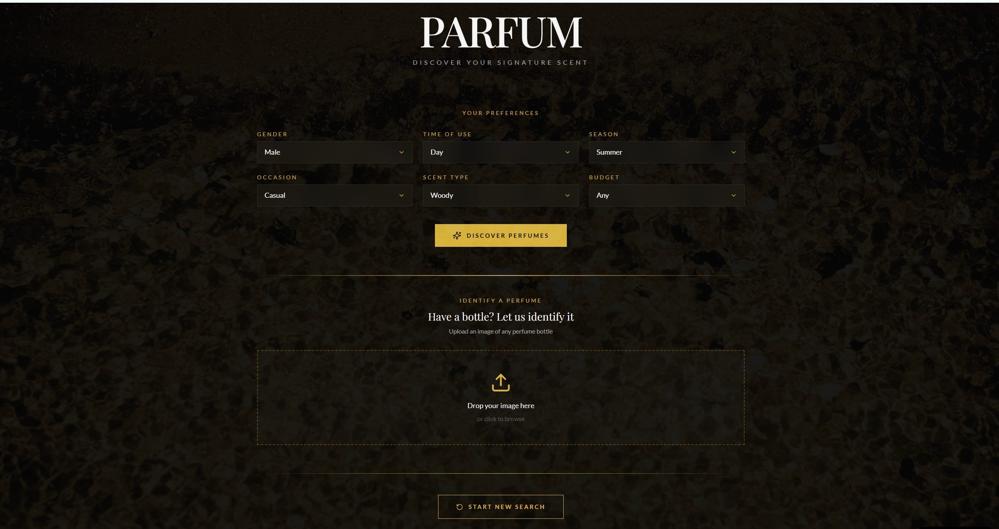
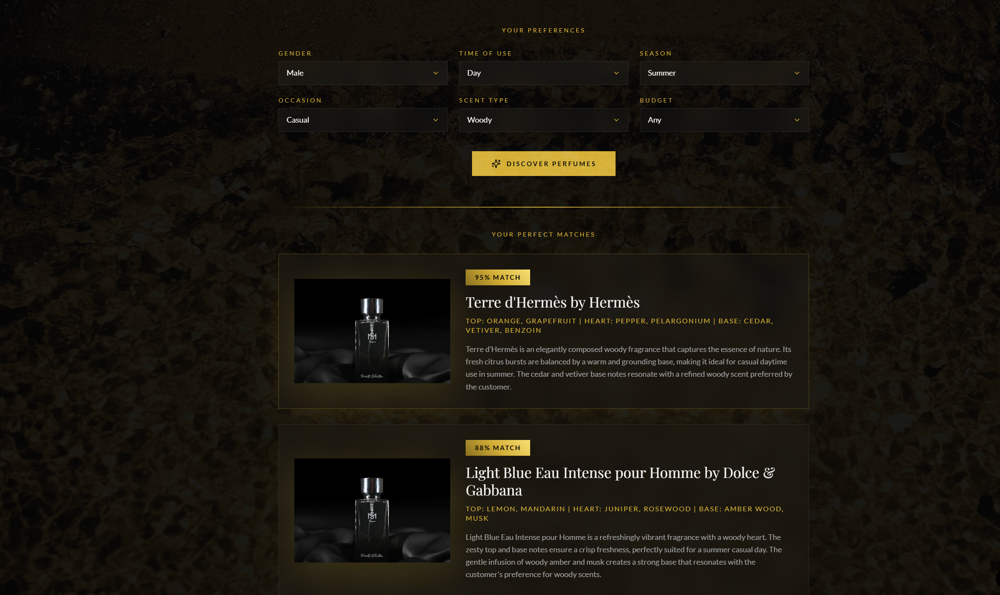
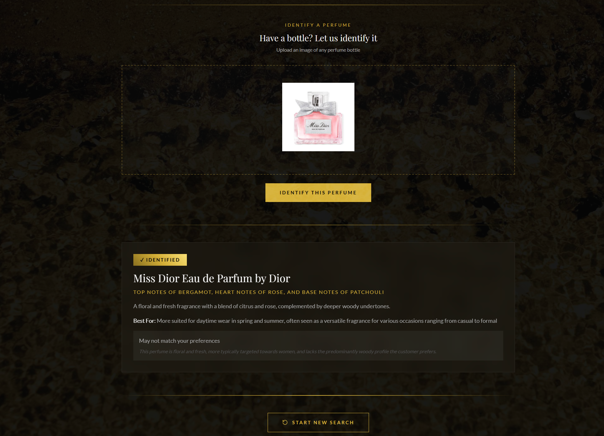

# Smart Perfume AI Recommendation Screen

This prototype was developed as part of the SDI Displays KTP project to explore the application of Generative AI in interactive retail environments.

The system captures customer preferences (gender, occasion, scent type, season, and budget) and dynamically generates personalised perfume recommendations to enhance in-store engagement.

Tech Stack: React (Frontend), FastAPI (Backend), GPT-powered recommendation logic.

## Demo Screenshots

